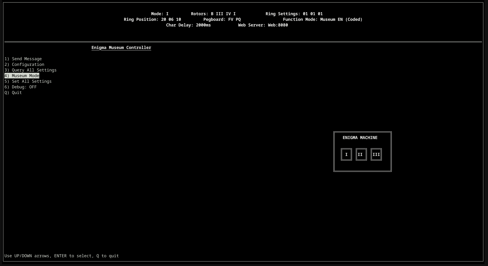
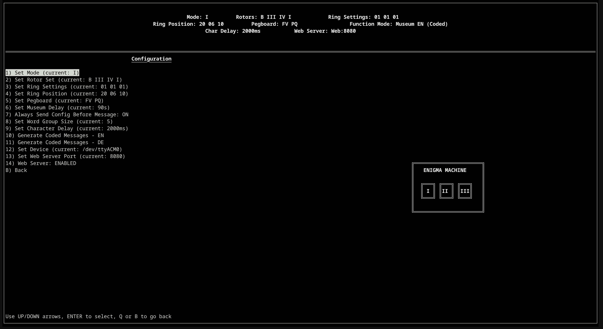
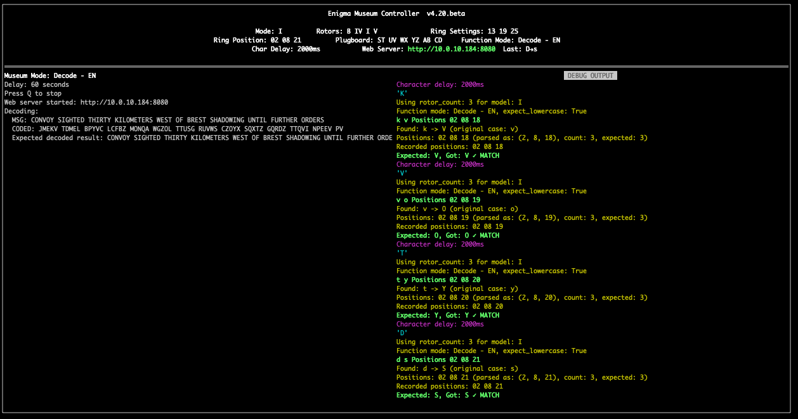
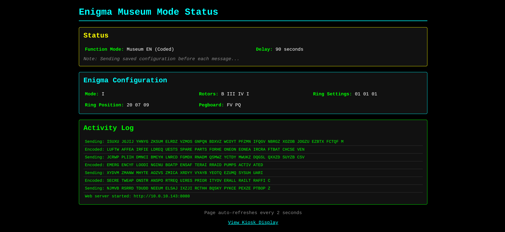

# Enigma Museum Controller

A Python-based control system for Enigma cipher machines, featuring a curses-based terminal interface and web server for museum displays.

> **⚠️ Early Work in Progress:** This project is in very early development stages. Features may be incomplete, documentation may be lacking, and the codebase is subject to significant changes. Use at your own risk and expect bugs and breaking changes.

## History

This controller software is designed to work with the **Enigma Touch**, a modern electronic replica of the legendary World War II Enigma cipher machine.

### The Enigma Touch Device

The Enigma Touch is a single-board electronic replica designed by **Jürgen Müller** that replicates the appearance and function of the original Enigma machine at a 2:3 scale. Manufactured and assembled by **CEDS**, it's a fully functional encryption device compatible with all military Enigma versions (I, II, III, M3, M4).

Unlike the original mechanical Enigma, the Enigma Touch uses capacitive touch technology for the keyboard and rotor controls, with LED displays showing rotor positions. Despite being all-electronic, it maintains the exact user experience of the original mechanical device.

We utilize the USB serial interface on the Enigma Touch to establish a serial API connection.

### Resources

- **Official Website**: [Obsolescence Guaranteed - Enigma Touch](https://obsolescence.dev/enigma-touch.html)
- **Purchase**: Available through [Obsolescence Guaranteed](https://obsolescence.dev/enigma-touch.html)
- **User Forum**: Community discussions and support (see official website)
- **Documentation**: User manual, reference card, and in-depth guides available on the [official website](https://obsolescence.dev/enigma-touch.html)

The Enigma Touch connects to computers via USB serial interface, making it perfect for museum displays, educational demonstrations, and hands-on cryptography experiences.

## Features

- **Interactive Terminal Interface**: Full curses-based menu system for controlling Enigma devices
- **Museum Mode**: Automated demonstration modes with configurable delays
- **Web Server**: Real-time web interface for museum kiosk displays
- **Message Encoding**: Send and encode messages character by character
- **Configuration Management**: Persistent settings with JSON configuration file
- **Debug Mode**: Optional serial communication debugging
- **Multiple Museum Modes**: Support for English and German messages, with optional pre-coded messages

## Screenshots

### Terminal Interface

#### Main Menu
The interactive curses-based terminal interface provides full control over the Enigma device:



#### Configuration Menu
Access all Enigma settings and application configuration through the intuitive menu system:



#### Museum Mode with Debug Panel
Monitor serial communication in real-time with the optional debug panel:



### Web Interface

#### Kiosk Display
The web-based kiosk display is optimized for museum installations, showing real-time encoding progress:


#### Status Page
Detailed status view showing all device information and current settings:



## Requirements

- Python 3.x
- [pyserial](https://pypi.org/project/pyserial/) (for serial communication)
- Enigma Touch device connected via USB serial interface
- Enigma Touch firmware 1.12+ (limited testing on different firmware versions)

### Python Dependencies

All Python dependencies are listed in `requirements.txt`. Install them with:
```bash
pip3 install -r requirements.txt
```

On macOS with Homebrew-managed Python, you may need:
```bash
pip3 install --break-system-packages -r requirements.txt
``` 

## Tested Hardware/Systems

- Raspberry Pi 2, 3, 4, 5 - Using [Raspberry Pi OS Lite](https://www.raspberrypi.com/software/)
- Raspberry Pi 1 - Works but slow due to single core; local display flickers
- ChromeOS Linux with USB Passthrough
- macOS (Tahoe)

In theory this should work on any system that supports Python 3 and has proper permissions to access USB serial devices. For the web server feature, ensure your system can bind to network ports.

## Installation

### Raspberry Pi Kiosk Installation (Recommended for Kiosks)

Create a new SD card using the [Raspberry Pi Imager](https://www.raspberrypi.com/software/). Choose Raspberry Pi OS Lite (32-bit or 64-bit). **Important:** Do not install the Desktop GUI when used for a kiosk display.

For Raspberry Pi systems, use the automated installation script:

1. **Clone the repository:**
```bash
git clone https://github.com/dotelpenguin/enigma-touch-museum.git
cd enigma-touch-museum
```

   Alternatively, download the latest release from the [GitHub repository](https://github.com/dotelpenguin/enigma-touch-museum).

2. **Run the installation script:**
```bash
chmod +x install.sh
./install.sh
```

The installation script will:
- Install Python 3 and pip3 (if not already installed)
- Install pyserial library (via apt or pip)
- Add your user to the `dialout` group (for serial device access)
- Create udev rules for persistent serial device permissions
- Create a startup script (`start-enigma-museum.sh`)
- Optionally enable console auto-login (recommended for kiosk mode)
- Optionally add auto-start to `~/.bashrc`

**During installation, you will be prompted to:**
- Select a default museum mode (EN/DE, coded or on-the-fly)
- Enable console auto-login (recommended for kiosk mode)
- Add startup script to `~/.bashrc` (for auto-start on login)

**After installation:**
1. If you were added to the dialout group, **log out and back in** (or run `newgrp dialout`)
2. If auto-login was enabled, **reboot** for it to take effect: `sudo reboot`
3. Test the application: `python3 enigma-museum.py --config` (If not set to autostart)

**Startup Script Behavior:**
- On boot/login, the script waits 5 seconds for user input
- If a key is pressed: offers Config mode, Shell, or Museum mode
- If no input: automatically starts Museum mode (using selected default)
- Auto-restarts if the application exits (kiosk mode)

**Uninstall:**
To remove auto-start and custom configurations:
```bash
./install.sh --uninstall
```

**Note:** The installation script is designed for Raspberry Pi OS Lite (console-only). If a desktop environment is detected, you'll be warned but can continue anyway.

### macOS Installation (Homebrew)

1. **Install Homebrew** (if not already installed):
```bash
/bin/bash -c "$(curl -fsSL https://raw.githubusercontent.com/Homebrew/install/HEAD/install.sh)"
```

2. **Install Python 3:**
```bash
brew install python3
```

3. **Clone the repository:**
```bash
git clone https://github.com/dotelpenguin/enigma-touch-museum.git
cd enigma-touch-museum
```

4. **Install dependencies using requirements.txt:**
```bash
pip3 install --break-system-packages -r requirements.txt
```

   **Note:** macOS uses externally-managed Python environments. The `--break-system-packages` flag is required for Homebrew-managed Python installations. Alternatively, you can use a virtual environment:
```bash
python3 -m venv venv
source venv/bin/activate
pip install -r requirements.txt
```

5. **Find your serial device:**
   On macOS, USB serial devices typically appear as `/dev/tty.usbserial-*` or `/dev/cu.usbserial-*`. To find your Enigma Touch device:
```bash
ls /dev/tty.usbserial* /dev/cu.usbserial* 2>/dev/null
# Or list all serial devices:
ls /dev/tty.* /dev/cu.* 2>/dev/null | grep -i usb
```

   The device path will be something like `/dev/tty.usbserial-1410` or `/dev/cu.usbserial-1410`. Use the `/dev/cu.*` path (not `/dev/tty.*`) for better compatibility.

6. **macOS Permissions:**
   macOS may prompt you to allow Terminal (or your terminal emulator) to access USB devices. If you encounter permission errors, check System Settings → Privacy & Security → USB Accessories.

### Generic Installation (Other Linux/Unix Systems)

1. **Install Python 3:**
```bash
# On Debian/Ubuntu/Raspberry Pi OS
sudo apt-get update
sudo apt-get install python3 python3-pip
```

2. **Clone the repository:**
```bash
git clone https://github.com/dotelpenguin/enigma-touch-museum.git
cd enigma-touch-museum
```

3. **Install dependencies:**
```bash
# Using requirements.txt (recommended)
pip3 install -r requirements.txt

# Or install manually
pip3 install pyserial

# Or on Debian/Ubuntu/Raspberry Pi OS (system package):
sudo apt-get install python3-serial
```

   See the [pyserial documentation](https://pyserial.readthedocs.io/) for more information.

4. **Ensure you have permissions to access the serial device:**
```bash
sudo usermod -a -G dialout $USER
# Log out and back in for changes to take effect
```

## Configuration

The application uses `enigma-museum-config.json` for persistent configuration. See [ENIGMA_PROTOCOL_DOCUMENTATION.md](ENIGMA_PROTOCOL_DOCUMENTATION.md) for detailed protocol information. 

**Note**: Currently there is no sanity checking on config settings, future TODO idem. 

You can configure:

- **Device Path**: Serial device path (e.g., `/dev/ttyACM0`)
- **Enigma Settings**: Mode, rotor set, ring settings, ring position, pegboard
- **Museum Delay**: Delay between messages in museum mode (seconds)
- **Character Delay**: Delay between characters during encoding (milliseconds)
- **Word Group Size**: Group size for encoded text display (4 or 5 characters)
- **Web Server**: Enable/disable and port configuration

### Initial Configuration

If the device is not connected, use the `--config` option to configure settings:

```bash
python3 enigma-museum.py --config
```

## Usage

### Basic Usage

```bash
python3 enigma-museum.py [OPTIONS] [DEVICE]
```

### Command-Line Options

- `--config`, `-c`: Open configuration menu without connecting to device
- `--museum-en`: Start directly in Museum EN mode (English messages)
- `--museum-de`: Start directly in Museum DE mode (German messages)
- `--museum-en-coded`: Start in Museum EN mode with pre-coded messages
- `--museum-de-coded`: Start in Museum DE mode with pre-coded messages
- `--debug`: Enable debug output panel (shows serial communication)
- `--help`, `-h`: Show help message and exit

### Examples

```bash
# Start with default device
python3 enigma-museum.py

# Configure settings without connecting
python3 enigma-museum.py --config

# Start directly in Museum EN mode
python3 enigma-museum.py --museum-en

# Start with specific device and debug enabled
python3 enigma-museum.py --debug /dev/ttyACM0

# Start Museum DE mode with pre-coded messages
python3 enigma-museum.py --museum-de-coded
```

## Main Menu Options

1. **Send Message**: Manually send and encode a message
2. **Museum Mode**: Start automated museum demonstration
3. **Configuration**: Access configuration menu
4. **Query Settings**: Query current device settings
5. **Set All Config**: Set all configurations from saved config
6. **Debug**: Toggle debug output panel

## Museum Modes

- **Museum EN**: English messages, encoded on-the-fly
- **Museum DE**: German messages, encoded on-the-fly
- **Museum EN (Coded)**: English messages, using pre-coded messages
- **Museum DE (Coded)**: German messages, using pre-coded messages

**Important:** German messages and translations were generated using AI and may contain inaccuracies or errors. Review and contributions from native German speakers are needed.

## Web Server

The web server provides real-time updates for museum displays:

- **Status Page** (`/status`): Detailed status view with all information
- **Message Page** (`/message`): Kiosk display optimized for 1024x768+ screens
  - Shows current message being encoded
  - Displays encoded text in real-time
  - Highlights current character (when delay >= 2000ms)
  - Updates ring position in real-time
  - Auto-refreshes every 2 seconds

### Enabling Web Server

1. Go to Configuration menu → Option 14: Web Server
2. Enable the web server
3. Configure the port (default: 8080)
4. Access at `http://<your-ip>:<port>/message` for kiosk view

## Configuration Menu

Access via Main Menu → Configuration:

1. Set Mode (I, II, III, M3, M4)
2. Set Rotor Set (e.g., "A III IV I")
3. Set Ring Settings (e.g., "01 01 01")
4. Set Ring Position (e.g., "20 6 10")
5. Set Pegboard (e.g., "VF PQ" or leave empty for clear)
6. Set Museum Delay (seconds between messages)
7. Always Send Config Before Message (toggle)
8. Set Word Group Size (4 or 5 characters)
9. Set Character Delay (milliseconds between characters)
10. Generate Coded Messages - EN
11. Generate Coded Messages - DE
12. Set Device (serial device path)
13. Set Web Server Port
14. Web Server Enable/Disable

## Message Files

- `english.msg`: English messages for museum mode
- `german.msg`: German messages for museum mode
- `english-coded.msg`: Pre-coded English messages (generated)
- `german-coded.msg`: Pre-coded German messages (generated)

**Note on German Translations:** The German messages and translations in this project were generated using AI translation tools and are likely inaccurate or may contain errors. These translations need review and cleanup by native German speakers. Contributions to improve the German translations are welcome - please see the [Contributing](#contributing) section.

## Features

### Character Highlighting

When character delay is 2000ms or greater, the current character being encoded is highlighted in yellow on the web interface.

### Real-Time Updates

- Encoded text updates as each character is encoded
- Ring position updates in real-time during encoding
- Web interface auto-refreshes every 2 seconds

### Ring Position Protection

Ring position updates during encoding are not saved to the config file. Only explicit changes via the configuration menu are persisted.

## Troubleshooting

### Cannot Connect to Device

**Linux/Raspberry Pi:**
1. Check device path: `ls -l /dev/ttyACM*` or `ls -l /dev/ttyUSB*`
2. Verify permissions: `groups` (should include `dialout`)
3. Use `--config` to change device path without connecting

**macOS:**
1. Check device path: `ls /dev/tty.usbserial* /dev/cu.usbserial*` or `ls /dev/tty.* /dev/cu.* | grep -i usb`
2. Use `/dev/cu.*` paths (not `/dev/tty.*`) for better compatibility
3. Check System Settings → Privacy & Security → USB Accessories if permission errors occur
4. Use `--config` to change device path without connecting

### Web Server Not Starting

1. Check if port is already in use: `netstat -tuln | grep <port>` or `ss -tuln | grep <port>`
2. Verify web server is enabled in configuration
3. Check firewall settings
4. Ensure the application has permissions to bind to the port

### Messages Not Encoding

1. Enable debug mode (`--debug` or menu option 6)
2. Check serial communication in debug panel
3. Verify device is in encode mode
4. Check message contains only A-Z characters (spaces and special characters are filtered)

## TODO

Future enhancements and improvements for the Enigma Museum Controller:

- [ ] Full German Translation (requires German speaker)
- [ ] Break Python into modules, and cleanup code. 
- [ ] Verify Enigma Touch is correctly configured and connected
- [ ] Error checking and linting for config settings (no validation currently)
- [ ] Pre-built Raspberry Pi image for easier kiosk deployment
- [ ] Bi-directional communication from Enigma to Kiosk Controller
- [ ] New message format allowing display of properly decoded messages with original spacing (also for simulation mode)
- [ ] Advanced web interface with JavaScript/WebSockets (better than refresh)
- [ ] Simulation Mode (when Enigma Touch is not connected)
- [ ] Enhance web interface with additional display options
- [ ] Add support for multiple simultaneous device connections (Interactive Encoding/Decoding)
- [ ] Add remote control API endpoints
- [ ] Improve error handling and recovery mechanisms
- [ ] Add unit tests and integration tests

## License

See [LICENSE](LICENSE) file for details.

## Contributing

Contributions are welcome! Please feel free to submit a Pull Request or open an Issue on the [GitHub repository](https://github.com/dotelpenguin/enigma-touch-museum).

## Author

Andrew Baker (DotelPenguin)  
Email: drew.baker@doteltech.com  
GitHub: [@dotelpenguin](https://github.com/dotelpenguin)

