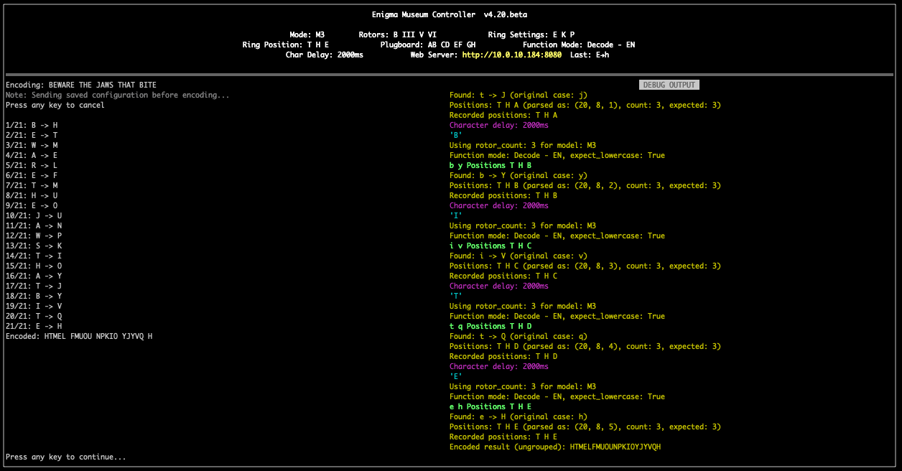

# Enigma Museum Controller

A Python-based control system for Enigma cipher machines, featuring a curses-based terminal interface and web server for museum displays.

> **⚠️ WORK IN PROGRESS:** This project is actively under development. Features may be incomplete, documentation may be lacking, and the codebase is subject to significant changes. Use at your own risk and expect bugs and breaking changes.
>
> **⚠️ FIRMWARE REQUIREMENT:** This software requires **Enigma Touch firmware version 4.20 or higher**. **Firmware 4.20 is the bare minimum** and some features may be limited. **Firmware 4.21 is required for all features** to work correctly. Earlier firmware versions are not supported. The application automatically checks firmware version on connection.
>
>
> **⚠️ CRITICAL WARNING - DEVICE LOCKOUT:** You can inadvertently lock yourself out of the Enigma Touch device by disabling the local buttons (kiosk/lock settings). If you disable local buttons and lose access to this application, you will be unable to unlock the device using the physical buttons. **To unlock a locked device, you must either:**
> - Use this application to re-enable the local buttons,
> - Use this application to factory reset the Enigma Touch,
> - If this application is not available, Re-flash the Enigma Touch firmware (see Offical Enigma Touch Documentation below)
>
> **Always ensure you have a way to access this application before disabling local buttons on your Enigma Touch device.**

## Why Did I Make This?

### The "OFFICIAL" Reason

This project was created to enable museum and educational displays using the Enigma Touch device. The goal is to provide:

- **Automated demonstrations** for museum visitors without requiring manual operation
- **Consistent configuration** management for multiple devices
- **Educational value** through automated encoding/decoding demonstrations
- **Reliable operation** in unattended kiosk environments

The Enigma Touch is an excellent educational tool, but operating it manually for extended periods in museum settings can be impractical. This software bridges that gap by providing automated control while maintaining the authentic Enigma experience.

### The REAL Reason

 - I have always been fascinated and drawn to the Enigma Cipher Machine.
 - I LOVE Blinkenlights

## History

This controller software is designed to work with the **Enigma Touch**, a modern electronic replica of the legendary World War II Enigma cipher machine.

### The Enigma Touch Device

The Enigma Touch is a single-board electronic replica designed by **Jürgen Müller** that replicates the appearance and function of the original Enigma machine at a 2:3 scale. Manufactured and assembled by **CEDS**, it's a fully functional encryption device compatible with all military Enigma versions (I, II, III, M3, M4).

Unlike the original mechanical Enigma, the Enigma Touch uses capacitive touch technology for the keyboard and rotor controls, with LED displays showing rotor positions. Despite being all-electronic, it maintains the exact user experience of the original mechanical device.

We utilize the USB serial interface on the Enigma Touch to establish a serial API connection.

### Resources

- **Official Website**: [Obsolescence Guaranteed - Enigma Touch](https://obsolescence.dev/enigma-touch.html)
- **Purchase**: Available through [Obsolescence Guaranteed](https://obsolescence.dev/enigma-touch.html)
- **User Forum**: Community discussions and support (see official website)
- **Documentation**: User manual, reference card, and in-depth guides available on the [official website](https://obsolescence.dev/enigma-touch.html)
- **Deep Dives**: Down the rabbit hole we go
   - [Wikipeedia](https://en.wikipedia.org/wiki/Enigma_machine)
   - [Enigma Museum](https://enigmamuseum.com/ecds.htm)
   - [Cipher Machines](https://ciphermachines.com/enigma)

The Enigma Touch connects to computers via USB serial interface, making it perfect for museum displays, educational demonstrations, and hands-on cryptography experiences.

## Features

- **Interactive Terminal Interface**: Full curses-based menu system for controlling Enigma devices
- **Museum Mode**: Automated demonstration modes with configurable delays
- **Web Server**: Real-time web interface for museum kiosk displays
- **Message Encoding**: Send and encode messages character by character
- **Configuration Management**: Persistent settings with JSON configuration file
- **Debug Mode**: Optional serial communication debugging
- **Multiple Museum Modes**: Support for English and German messages, with optional pre-coded messages

## Screenshots

### Terminal Interface

#### Main Menu
The interactive curses-based terminal interface provides full control over the Enigma device:


#### Message Mode
Encode/Decode messages using Enigma Touch


#### Configuration Menu
Access all Enigma settings and application configuration through the intuitive menu system:


#### Museum Mode with Debug Panel
Monitor serial communication in real-time with the optional debug panel:


### Web Interface

#### Kiosk Display
The web-based kiosk display is optimized for museum installations, showing real-time encoding progress:


#### Status Page
Detailed status view showing all device information and current settings:


## Requirements

- Python 3.x
- [pyserial](https://pypi.org/project/pyserial/) (for serial communication)
- Enigma Touch device connected via USB serial interface
- **Enigma Touch firmware 4.20 or higher** (required - earlier versions are not supported). **Firmware 4.20 is the bare minimum**; **firmware 4.21 is required for all features**. Firmware version is automatically checked on connection.

### Python Dependencies

All Python dependencies are listed in `requirements.txt`. Install them with:
```bash
pip3 install -r requirements.txt
```

On macOS with Homebrew-managed Python, you may need:
```bash
pip3 install --break-system-packages -r requirements.txt
``` 

## Tested Hardware/Systems

- Raspberry Pi 2, 3, 4, 5 - Using [Raspberry Pi OS Lite](https://www.raspberrypi.com/software/)
- ChromeOS Linux with USB Passthrough
- macOS (Tahoe)

**Minimum Requirements:** Raspberry Pi 2 or higher recommended. Pi 1 is no longer supported due to performance limitations.

In theory this should work on any system that supports Python 3 and has proper permissions to access USB serial devices. For the web server feature, ensure your system can bind to network ports.

## Installation

### Raspberry Pi Kiosk Installation (Recommended for Kiosks)

Create a new SD card using the [Raspberry Pi Imager](https://www.raspberrypi.com/software/). Choose Raspberry Pi OS Lite (32-bit or 64-bit). **Important:** Do not install the Desktop GUI when used for a kiosk display.

For Raspberry Pi systems, use the automated installation script:

1. **Clone the repository:**
```bash
git clone https://github.com/dotelpenguin/enigma-touch-museum.git
cd enigma-touch-museum
```

   Alternatively, download the latest release from the [GitHub repository](https://github.com/dotelpenguin/enigma-touch-museum).

2. **Run the installation script:**
```bash
chmod +x install.sh
./install.sh
```

The installation script will:
- Install Python 3 and pip3 (if not already installed)
- Install pyserial library (via apt or pip)
- Add your user to the `dialout` group (for serial device access)
- Create udev rules for persistent serial device permissions
- Create a startup script (`start-enigma-museum.sh`)
- Optionally enable console auto-login (recommended for kiosk mode)
- Optionally add auto-start to `~/.bashrc`

**During installation, you will be prompted to:**
- Select a default museum mode (Encode/Decode - EN/DE)
- Enable console auto-login (recommended for kiosk mode)
- Add startup script to `~/.bashrc` (for auto-start on login)

**After installation:**
1. If you were added to the dialout group, **log out and back in** (or run `newgrp dialout`)
2. If auto-login was enabled, **reboot** for it to take effect: `sudo reboot`
3. Test the application: `python3 main.py --config` (If not set to autostart)

**Startup Script Behavior:**
- On boot/login, the script waits 5 seconds for user input
- If a key is pressed: offers Config mode, Shell, or Museum mode
- If no input: automatically starts Museum mode (using selected default)
- Auto-restarts if the application exits (kiosk mode)

**Uninstall:**
To remove auto-start and custom configurations:
```bash
./install.sh --uninstall
```

**Note:** The installation script is designed for Raspberry Pi OS Lite (console-only). If a desktop environment is detected, you'll be warned but can continue anyway.

### macOS Installation (Homebrew)

1. **Install Homebrew** (if not already installed):
```bash
/bin/bash -c "$(curl -fsSL https://raw.githubusercontent.com/Homebrew/install/HEAD/install.sh)"
```

2. **Install Python 3:**
```bash
brew install python3
```

3. **Clone the repository:**
```bash
git clone https://github.com/dotelpenguin/enigma-touch-museum.git
cd enigma-touch-museum
```

4. **Install dependencies using requirements.txt:**
```bash
pip3 install --break-system-packages -r requirements.txt
```

   **Note:** macOS uses externally-managed Python environments. The `--break-system-packages` flag is required for Homebrew-managed Python installations. Alternatively, you can use a virtual environment:
```bash
python3 -m venv venv
source venv/bin/activate
pip install -r requirements.txt
```

5. **Find your serial device:**
   On macOS, USB serial devices typically appear as `/dev/tty.usbserial-*` or `/dev/cu.usbserial-*`. To find your Enigma Touch device:
```bash
ls /dev/tty.usbserial* /dev/cu.usbserial* 2>/dev/null
# Or list all serial devices:
ls /dev/tty.* /dev/cu.* 2>/dev/null | grep -i usb
```

   The device path will be something like `/dev/tty.usbserial-1410` or `/dev/cu.usbserial-1410`. Use the `/dev/cu.*` path (not `/dev/tty.*`) for better compatibility.

6. **macOS Permissions:**
   macOS may prompt you to allow Terminal (or your terminal emulator) to access USB devices. If you encounter permission errors, check System Settings → Privacy & Security → USB Accessories.

### Generic Installation (Other Linux/Unix Systems)

1. **Install Python 3:**
```bash
# On Debian/Ubuntu/Raspberry Pi OS
sudo apt-get update
sudo apt-get install python3 python3-pip
```

2. **Clone the repository:**
```bash
git clone https://github.com/dotelpenguin/enigma-touch-museum.git
cd enigma-touch-museum
```

3. **Install dependencies:**
```bash
# Using requirements.txt (recommended)
pip3 install -r requirements.txt

# Or install manually
pip3 install pyserial

# Or on Debian/Ubuntu/Raspberry Pi OS (system package):
sudo apt-get install python3-serial
```

   See the [pyserial documentation](https://pyserial.readthedocs.io/) for more information.

4. **Ensure you have permissions to access the serial device:**
```bash
sudo usermod -a -G dialout $USER
# Log out and back in for changes to take effect
```

## Configuration

The application uses `enigma-museum-config.json` for persistent configuration. **⚠️ IMPORTANT: This file is automatically managed by the Python script and should NOT be edited manually.** All configuration changes should be made through the application's menu system. Manual edits may be overwritten or cause unexpected behavior.

See [ENIGMA_PROTOCOL_DOCUMENTATION.md](ENIGMA_PROTOCOL_DOCUMENTATION.md) for detailed protocol information. 

**⚠️ IMPORTANT - Kiosk/Lock Settings Warning:**

The kiosk/lock settings allow you to disable local buttons on the Enigma Touch device. **Use extreme caution when enabling these settings:**

- **Lock Model**: Prevents changing the Enigma model via physical buttons
- **Lock Rotor**: Prevents changing rotor settings via physical buttons  
- **Lock Ring**: Prevents changing ring settings via physical buttons
- **Disable Power Off**: Prevents powering off via physical buttons

**If you disable local buttons and lose access to this application, you will be locked out of your device.** The only ways to unlock are:
1. Use this application to re-enable the local buttons (Menu → Send Enigma Lock Config)
2. Use Factory Reset (Menu → Factory Reset Enigma) - resets all settings including locks
3. Re-flash the Enigma Touch firmware

**Always ensure you have reliable access to this application before enabling kiosk/lock settings.**

**Note**: Configuration settings are validated when sent to the Enigma device. Invalid settings (e.g., duplicate mappings, invalid options, rotor used twice) will be detected and the user will be prompted to fix them. The application will automatically switch to the configuration menu if errors are detected when sending config to the device. 

All configuration is managed through the application's menu system. The `enigma-museum-config.json` file stores your settings automatically. **Do not edit this file manually** - use the menu options instead.

You can configure:

- **Device Path**: Serial device path (e.g., `/dev/ttyACM0`)
- **Enigma Settings**: Mode, rotor set, ring settings, ring position, pegboard
- **Museum Delay**: Delay between messages in museum mode (seconds)
- **Character Delay**: Delay between characters during encoding (milliseconds)
- **Word Group Size**: Group size for encoded text display (4 or 5 characters)
- **Web Server**: Enable/disable and port configuration

### Initial Configuration

If the device is not connected, use the `--config` option to configure settings:

```bash
python3 main.py --config
```

**Note:** All configuration changes are automatically saved to `enigma-museum-config.json`. The file format may change between versions - always use the menu system to modify settings.

## Usage

### Basic Usage

```bash
python3 main.py [OPTIONS] [DEVICE]
```

### Command-Line Options

- `--config`, `-c`: Open configuration menu without connecting to device
- `--museum-en-encode`: Start directly in Encode - EN mode (English encode)
- `--museum-en-decode`: Start directly in Decode - EN mode (English decode)
- `--museum-de-encode`: Start directly in Encode - DE mode (German encode)
- `--museum-de-decode`: Start directly in Decode - DE mode (German decode)
- `--debug`: Enable debug output panel (shows serial communication). **Note:** Debug is enabled by default; this option explicitly enables it. Debug can be toggled on/off via the main menu (option 8).
- `--send-lock-config`: Send kiosk/lock settings to device from saved configuration (⚠️ use with caution - see lockout warning above)
- `--factory-reset`: Factory reset the Enigma Touch device (⚠️ resets all settings to factory defaults - requires confirmation)
- `--help`, `-h`: Show help message and exit

### Examples

```bash
# Start with default device
python3 main.py

# Configure settings without connecting
python3 main.py --config

# Start directly in Encode - EN mode
python3 main.py --museum-en-encode

# Start with specific device and debug enabled
python3 main.py --debug /dev/ttyACM0

# Start Decode - DE mode
python3 main.py --museum-de-decode

# Start Encode - DE mode with specific device
python3 main.py --museum-de-encode /dev/ttyUSB0

# Send kiosk/lock settings to device
python3 main.py --send-lock-config

# Factory reset device (requires confirmation)
python3 main.py --factory-reset
```

## Main Menu Options

1. **Send Message**: Manually send and encode a message
2. **Configuration**: Access configuration menu
3. **Query All Settings**: Query current device settings
4. **Museum Mode**: Start automated museum demonstration
5. **Send Enigma Config**: Send Enigma configuration settings to device (mode, rotors, rings, pegboard)
6. **Send Enigma Lock Config**: Send kiosk/lock settings to device (⚠️ use with caution - see lockout warning above)
7. **Factory Reset Enigma**: Factory reset the Enigma Touch device (⚠️ resets all settings to factory defaults)
8. **Debug**: Toggle debug output panel
9. **Raw Debug**: Toggle raw debug output (shows raw serial bytes)
Q. **Quit**: Exit the application

## Museum Modes

The museum mode menu offers four options (numbered 1-4):

1. **Encode - EN**: English messages, encode mode (sends original messages, verifies encoded results)
2. **Decode - EN**: English messages, decode mode (sends coded messages, verifies decoded results)
3. **Encode - DE**: German messages, encode mode (sends original messages, verifies encoded results)
4. **Decode - DE**: German messages, decode mode (sends coded messages, verifies decoded results)

All modes use JSON files with pre-generated messages (`english-encoded.json` or `german-encoded.json`). These files must be generated first using the Configuration menu (options 10 or 11).

**Important:** German messages and translations were generated using AI and may contain inaccuracies or errors. Review and contributions from native German speakers are needed.

## Web Server

The web server provides real-time updates for museum displays:

- **Status Page** (`/status`): Detailed status view with all information
- **Message Page** (`/message`): Kiosk display optimized for 1024x768+ screens
  - Shows current message being encoded
  - Displays encoded text in real-time
  - Highlights current character (when delay >= 2000ms)
  - Updates ring position in real-time
  - Auto-refreshes every 2 seconds

### Enabling Web Server

1. Go to Configuration menu → Option 14: Web Server
2. Enable the web server
3. Configure the port (default: 8080)
4. Access at `http://<your-ip>:<port>/message` for kiosk view

**Note:** The web server runs in the background and updates automatically. The terminal interface remains available for configuration and control.

## Configuration Menu

Access via Main Menu → Configuration:

The configuration menu is organized into sub-menus:

### Enigma Cipher Options
1. Set Device (serial device path)
2. Set Mode (I, II, III, M3, M4)
3. Set Rotor Set (e.g., "A III IV I")
4. Set Rings (e.g., "01 01 01")
5. Set Ring Position (e.g., "20 6 10")
6. Set Plugboard (e.g., "VF PQ" or leave empty for clear)
7. Always Send Config Before Message (toggle)

### WebPage Options
1. Set Word Group (4 or 5 characters)
2. Set Character Delay (milliseconds between characters)
3. Web Server Enable/Disable
4. Set Web Server Port
5. Enable Slides

### Enigma Touch Device Options
1. Set Museum Delay (seconds between messages)
2. Lock Model (toggle)
3. Lock Rotor/Wheel (toggle)
4. Lock Ring (toggle)
5. Disable Auto-PowerOff (toggle)
6. Set Brightness (1-5)
7. Set Volume (0-6)
8. Set Screen Saver (0-99 minutes)

### Utilities
1. Generate Coded Messages - EN
2. Generate Coded Messages - DE
3. Validate Models.json
4. (Additional utility options)

## Message Files

- `english.msg`: Source English messages for museum mode
- `german.msg`: Source German messages for museum mode
- `english-encoded.json`: Generated English messages with encoding metadata (JSON format)
- `german-encoded.json`: Generated German messages with encoding metadata (JSON format)

**Note:** The JSON files (`*-encoded.json`) are generated from the source message files (`.msg`) using the Configuration menu options 10 (Generate Coded Messages - EN) or 11 (Generate Coded Messages - DE). These JSON files contain the original messages along with their encoded/decoded results and configuration settings.

**Note on German Translations:** The German messages and translations in this project were generated using AI translation tools and are likely inaccurate or may contain errors. These translations need review and cleanup by native German speakers. Contributions to improve the German translations are welcome - please see the [Contributing](#contributing) section.

## Features

### Character Highlighting

When character delay is 2000ms or greater, the current character being encoded is highlighted in yellow on the web interface.

### Real-Time Updates

- Encoded text updates as each character is encoded
- Ring position updates in real-time during encoding
- Web interface auto-refreshes every 2 seconds

### Ring Position Protection

Ring position updates during encoding are not saved to the config file. Only explicit changes via the configuration menu are persisted.

### Configuration Error Handling

The application includes comprehensive error detection and handling:

- **Automatic Error Detection**: All Enigma device error responses are automatically detected using pattern matching
- **Error Types**: Detects all error types including invalid options, duplicate mappings, rotor conflicts, and more
- **Automatic Recovery**: When configuration errors are detected, the application automatically switches to the configuration menu
- **Input Validation**: Input lines are automatically cleared on error to allow clean re-entry
- **User Notification**: Error messages are displayed in the debug output with color coding (red for errors)

## Troubleshooting

### Cannot Connect to Device

**Linux/Raspberry Pi:**
1. Check device path: `ls -l /dev/ttyACM*` or `ls -l /dev/ttyUSB*`
2. Verify permissions: `groups` (should include `dialout`)
3. Use `--config` to change device path without connecting

**macOS:**
1. Check device path: `ls /dev/tty.usbserial* /dev/cu.usbserial*` or `ls /dev/tty.* /dev/cu.* | grep -i usb`
2. Use `/dev/cu.*` paths (not `/dev/tty.*`) for better compatibility
3. Check System Settings → Privacy & Security → USB Accessories if permission errors occur
4. Use `--config` to change device path without connecting

### Web Server Not Starting

1. Check if port is already in use: `netstat -tuln | grep <port>` or `ss -tuln | grep <port>`
2. Verify web server is enabled in configuration
3. Check firewall settings
4. Ensure the application has permissions to bind to the port

### Messages Not Encoding

1. **Verify firmware version**: The application automatically checks firmware version on connection. Ensure your Enigma Touch has firmware 4.20 or higher. **Firmware 4.20 is the bare minimum**; **firmware 4.21 is required for all features**.
2. Verify Enigma touch is using the proper logging method. (Line returns enabled, either 4,5 mode)
3. Enable debug mode (`--debug` or menu option 7)
4. Check serial communication in debug panel
5. Verify device is in encode mode
6. Check message contains only A-Z characters (spaces and special characters are filtered)
7. Check for configuration errors - if config errors are detected, the application will automatically switch to the config menu

### Device Locked Out (Kiosk/Lock Settings)

If you've disabled local buttons and can't access the device:

1. **First, try to unlock using this application:**
   - Run the application: `python3 main.py`
   - Go to Main Menu → Option 6: "Send Enigma Lock Config"
   - Disable the lock settings (set lock_model, lock_rotor, lock_ring, and disable_power_off to false)
   - This will restore local button access

2. **If you cannot access this application:**
   - You will need to re-flash the Enigma Touch firmware
   - See the [official Enigma Touch documentation](https://obsolescence.dev/enigma-touch.html) for firmware flashing instructions

**Prevention:** Always ensure you have reliable access to this application before enabling kiosk/lock settings. Consider testing the unlock procedure before enabling locks in a production environment.

### Configuration Errors

If you receive configuration errors when sending settings to the Enigma device:

1. The application will automatically detect errors matching the pattern: `^` + line return + `*** ` + error message
2. Common errors include:
   - `*** Invalid option`: Invalid configuration value
   - `*** Duplicate mapping`: Duplicate pegboard or rotor mappings
   - `*** Rotor used twice`: Same rotor used multiple times in rotor set
3. When an error is detected:
   - Error message is displayed in debug output
   - Application automatically switches to configuration menu
   - Input line is cleared for clean re-entry
   - You must fix the configuration before continuing

## TODO

Future enhancements and improvements for the Enigma Museum Controller:

- [ ] Full German Translation (requires German speaker)
- [ ] Pre-built Raspberry Pi image for easier kiosk deployment
- [ ] Advanced web interface with JavaScript/WebSockets (better than refresh)
- [ ] Simulation Mode (when Enigma Touch is not connected)
- [ ] Enhance web interface with additional display options
- [ ] Add support for multiple simultaneous device connections (Interactive Encoding/Decoding)
- [ ] Add remote control API endpoints
- [ ] Add unit tests and integration tests
- [ ] WebHost Display flickers due to refresh
- [ ] Implement Counter for Models using Counters
- [ ] Remove more internal Logic. We should rely more on the Enigma Touch for the source of truth
- [ ] Make non AI garbage slides


## Known Issues

- Only ONE WebPage can be connected at a time due to limitations of the Python Library.


## License

See [LICENSE](LICENSE) file for details.

## Contributing

Contributions are welcome! Please feel free to submit a Pull Request or open an Issue on the [GitHub repository](https://github.com/dotelpenguin/enigma-touch-museum).

## Author

Andrew Baker (DotelPenguin)  
Email: drew.baker@doteltech.com  
GitHub: [@dotelpenguin](https://github.com/dotelpenguin)

